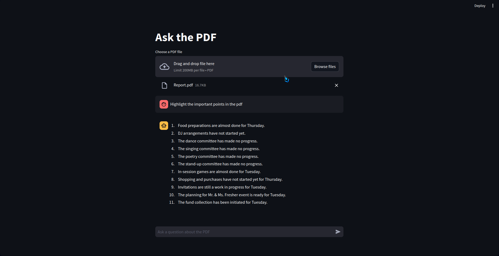

# Ask The PDF

Ask the PDF is a Streamlit application that allows users to ask questions about a PDF file and get answers from a large language model (LLM).

The project uses the following components:

- RecursiveCharacterTextSplitter: This is a text splitter that splits text into individual characters. This is necessary because the LLM used in the project (ChatOpenAI) is trained on character-level data.
- OpenAIEmbeddings: This is an embedding model that can be used to convert text into vectors. These vectors are used to represent the meaning of the text in a way that the LLM can understand.
- Chroma: This is a vector store that can be used to store and retrieve the vectors generated by the OpenAIEmbeddings model.
- ChatOpenAI: This is a large language model that can be used to generate text, translate languages, write different kinds of creative content, and answer your questions in an informative way.
- PyPDFLoader: This is a Python library that can be used to load and parse PDF files.

The project works as follows:

1. The user uploads a PDF file.
2. The PDF file is split into individual characters using the RecursiveCharacterTextSplitter.
3. The characters are converted into vectors using the OpenAIEmbeddings model.
4. The vectors are stored in the Chroma vector store.
5. The user asks a question about the PDF file.
6. The question is converted into vectors using the OpenAIEmbeddings model.
7. The vectors are used to retrieve similar vectors from the Chroma vector store.
8. The retrieved vectors are used to generate an answer to the question using the ChatOpenAI model.
9. The answer is displayed to the user.

Here are some of the benefits of Ask the PDF:

- It can be used to quickly and easily find information in a PDF file.
- It can be used to ask questions about the PDF file that would be difficult or time-consuming to answer on your own.
- It is easy to use, even for people who are not familiar with AI or machine learning.

### NOTE:
Please setup the OPENAI_API_KEY in your environment before running the application

run: `streamlit run app.py`

